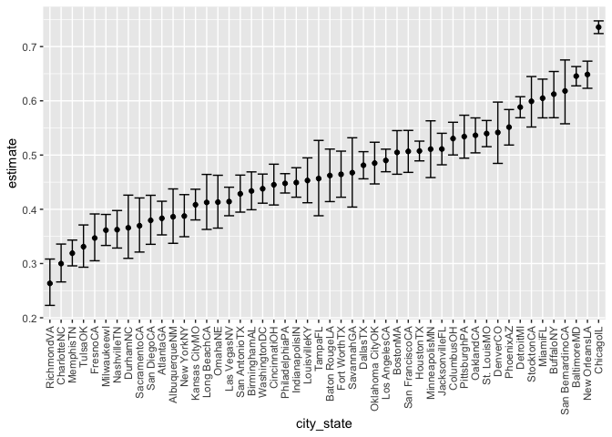
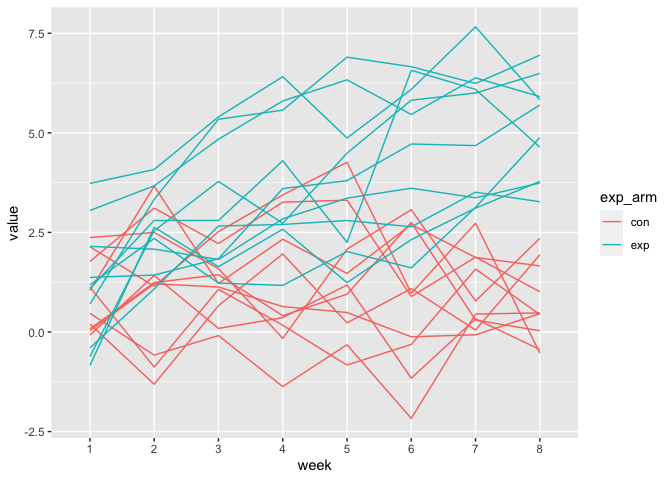

p8105\_hw5\_sm4993
================
Sydney Musick

# Problem 1

``` r
library(tidyverse)
```

    ## ── Attaching packages ─────────────────────────────────────── tidyverse 1.3.1 ──

    ## ✓ ggplot2 3.3.5     ✓ purrr   0.3.4
    ## ✓ tibble  3.1.4     ✓ dplyr   1.0.7
    ## ✓ tidyr   1.1.3     ✓ stringr 1.4.0
    ## ✓ readr   2.0.1     ✓ forcats 0.5.1

    ## ── Conflicts ────────────────────────────────────────── tidyverse_conflicts() ──
    ## x dplyr::filter() masks stats::filter()
    ## x dplyr::lag()    masks stats::lag()

``` r
homicide_df = 
  read.csv("homicide-data.csv", na = c("", "Unknown")) %>%
  mutate(
    city_state = str_c(city, state),
    resolution = case_when(
      disposition == "Closed without arrest" ~ "unsolved",
      disposition == "Open/No arrest" ~"unsolved",
      disposition == "Closed by arrest" ~"solved"
    )) %>%
  relocate(city_state) %>%
  filter(city_state != "TulsaAL")              
```

``` r
baltimore_df =
  homicide_df %>%
  filter(city_state == "BaltimoreMD")

baltimore_summary = 
  baltimore_df %>%
  summarize(
    unsolved = sum(resolution == "unsolved"),
    n = n())

baltimore_test =
  prop.test(
    x = baltimore_summary %>% pull(unsolved), 
    n = baltimore_summary %>% pull(n))

baltimore_test %>%
  broom::tidy()
```

    ## # A tibble: 1 × 8
    ##   estimate statistic  p.value parameter conf.low conf.high method    alternative
    ##      <dbl>     <dbl>    <dbl>     <int>    <dbl>     <dbl> <chr>     <chr>      
    ## 1    0.646      239. 6.46e-54         1    0.628     0.663 1-sample… two.sided

``` r
prop_test_function = function(city_df) {

city_summary = 
  city_df %>%
  summarize(
    unsolved = sum(resolution == "unsolved"),
    n = n())

city_test =
  prop.test(
    x = city_summary %>% pull(unsolved), 
    n = city_summary %>% pull(n))

return(city_test)

}

prop_test_function(baltimore_df)
```

    ## 
    ##  1-sample proportions test with continuity correction
    ## 
    ## data:  city_summary %>% pull(unsolved) out of city_summary %>% pull(n), null probability 0.5
    ## X-squared = 239.01, df = 1, p-value < 2.2e-16
    ## alternative hypothesis: true p is not equal to 0.5
    ## 95 percent confidence interval:
    ##  0.6275625 0.6631599
    ## sample estimates:
    ##         p 
    ## 0.6455607

``` r
results_df = 
  homicide_df %>%
  nest(data = uid:resolution) %>%
  mutate(
    test_results = map(data, prop_test_function),
    tidy_results = map(test_results, broom::tidy)
  ) %>%
  select(city_state, tidy_results) %>%
  unnest(tidy_results) %>%
  select(city_state, estimate, starts_with("conf"))

results_df
```

    ## # A tibble: 50 × 4
    ##    city_state    estimate conf.low conf.high
    ##    <chr>            <dbl>    <dbl>     <dbl>
    ##  1 AlbuquerqueNM    0.386    0.337     0.438
    ##  2 AtlantaGA        0.383    0.353     0.415
    ##  3 BaltimoreMD      0.646    0.628     0.663
    ##  4 Baton RougeLA    0.462    0.414     0.511
    ##  5 BirminghamAL     0.434    0.399     0.469
    ##  6 BostonMA         0.505    0.465     0.545
    ##  7 BuffaloNY        0.612    0.569     0.654
    ##  8 CharlotteNC      0.300    0.266     0.336
    ##  9 ChicagoIL        0.736    0.724     0.747
    ## 10 CincinnatiOH     0.445    0.408     0.483
    ## # … with 40 more rows

``` r
results_df %>%
  mutate(city_state = fct_reorder(city_state, estimate)) %>%
  ggplot(aes(x = city_state, y = estimate)) +
  geom_point() +
  geom_errorbar(aes(ymin = conf.low, ymax = conf.high)) +
  theme(axis.text.x = element_text(angle = 90, vjust = 0.5, hjust = 1))
```

<!-- -->

# Problem 2

## Data import and cleaning

``` r
zip = 
  tibble(files = 
    list.files("p8105_hw5_sm4993_files/data/", full.names = TRUE)) %>%
  mutate(data = map(files, read_csv)) %>% 
  unnest(data) %>% 
  mutate(
    exp_arm = substr(files, 30, 32),
    id = substr(files, 30, 35)) %>% 
  select(everything(), -files) %>% 
  pivot_longer(
    week_1:week_8,
    names_to = "week",
    names_prefix = "week_",
    values_to = "value")
```

    ## Rows: 1 Columns: 8

    ## ── Column specification ────────────────────────────────────────────────────────
    ## Delimiter: ","
    ## dbl (8): week_1, week_2, week_3, week_4, week_5, week_6, week_7, week_8

    ## 
    ## ℹ Use `spec()` to retrieve the full column specification for this data.
    ## ℹ Specify the column types or set `show_col_types = FALSE` to quiet this message.

    ## Rows: 1 Columns: 8

    ## ── Column specification ────────────────────────────────────────────────────────
    ## Delimiter: ","
    ## dbl (8): week_1, week_2, week_3, week_4, week_5, week_6, week_7, week_8

    ## 
    ## ℹ Use `spec()` to retrieve the full column specification for this data.
    ## ℹ Specify the column types or set `show_col_types = FALSE` to quiet this message.

    ## Rows: 1 Columns: 8

    ## ── Column specification ────────────────────────────────────────────────────────
    ## Delimiter: ","
    ## dbl (8): week_1, week_2, week_3, week_4, week_5, week_6, week_7, week_8

    ## 
    ## ℹ Use `spec()` to retrieve the full column specification for this data.
    ## ℹ Specify the column types or set `show_col_types = FALSE` to quiet this message.

    ## Rows: 1 Columns: 8

    ## ── Column specification ────────────────────────────────────────────────────────
    ## Delimiter: ","
    ## dbl (8): week_1, week_2, week_3, week_4, week_5, week_6, week_7, week_8

    ## 
    ## ℹ Use `spec()` to retrieve the full column specification for this data.
    ## ℹ Specify the column types or set `show_col_types = FALSE` to quiet this message.

    ## Rows: 1 Columns: 8

    ## ── Column specification ────────────────────────────────────────────────────────
    ## Delimiter: ","
    ## dbl (8): week_1, week_2, week_3, week_4, week_5, week_6, week_7, week_8

    ## 
    ## ℹ Use `spec()` to retrieve the full column specification for this data.
    ## ℹ Specify the column types or set `show_col_types = FALSE` to quiet this message.

    ## Rows: 1 Columns: 8

    ## ── Column specification ────────────────────────────────────────────────────────
    ## Delimiter: ","
    ## dbl (8): week_1, week_2, week_3, week_4, week_5, week_6, week_7, week_8

    ## 
    ## ℹ Use `spec()` to retrieve the full column specification for this data.
    ## ℹ Specify the column types or set `show_col_types = FALSE` to quiet this message.

    ## Rows: 1 Columns: 8

    ## ── Column specification ────────────────────────────────────────────────────────
    ## Delimiter: ","
    ## dbl (8): week_1, week_2, week_3, week_4, week_5, week_6, week_7, week_8

    ## 
    ## ℹ Use `spec()` to retrieve the full column specification for this data.
    ## ℹ Specify the column types or set `show_col_types = FALSE` to quiet this message.

    ## Rows: 1 Columns: 8

    ## ── Column specification ────────────────────────────────────────────────────────
    ## Delimiter: ","
    ## dbl (8): week_1, week_2, week_3, week_4, week_5, week_6, week_7, week_8

    ## 
    ## ℹ Use `spec()` to retrieve the full column specification for this data.
    ## ℹ Specify the column types or set `show_col_types = FALSE` to quiet this message.

    ## Rows: 1 Columns: 8

    ## ── Column specification ────────────────────────────────────────────────────────
    ## Delimiter: ","
    ## dbl (8): week_1, week_2, week_3, week_4, week_5, week_6, week_7, week_8

    ## 
    ## ℹ Use `spec()` to retrieve the full column specification for this data.
    ## ℹ Specify the column types or set `show_col_types = FALSE` to quiet this message.

    ## Rows: 1 Columns: 8

    ## ── Column specification ────────────────────────────────────────────────────────
    ## Delimiter: ","
    ## dbl (8): week_1, week_2, week_3, week_4, week_5, week_6, week_7, week_8

    ## 
    ## ℹ Use `spec()` to retrieve the full column specification for this data.
    ## ℹ Specify the column types or set `show_col_types = FALSE` to quiet this message.

    ## Rows: 1 Columns: 8

    ## ── Column specification ────────────────────────────────────────────────────────
    ## Delimiter: ","
    ## dbl (8): week_1, week_2, week_3, week_4, week_5, week_6, week_7, week_8

    ## 
    ## ℹ Use `spec()` to retrieve the full column specification for this data.
    ## ℹ Specify the column types or set `show_col_types = FALSE` to quiet this message.

    ## Rows: 1 Columns: 8

    ## ── Column specification ────────────────────────────────────────────────────────
    ## Delimiter: ","
    ## dbl (8): week_1, week_2, week_3, week_4, week_5, week_6, week_7, week_8

    ## 
    ## ℹ Use `spec()` to retrieve the full column specification for this data.
    ## ℹ Specify the column types or set `show_col_types = FALSE` to quiet this message.

    ## Rows: 1 Columns: 8

    ## ── Column specification ────────────────────────────────────────────────────────
    ## Delimiter: ","
    ## dbl (8): week_1, week_2, week_3, week_4, week_5, week_6, week_7, week_8

    ## 
    ## ℹ Use `spec()` to retrieve the full column specification for this data.
    ## ℹ Specify the column types or set `show_col_types = FALSE` to quiet this message.

    ## Rows: 1 Columns: 8

    ## ── Column specification ────────────────────────────────────────────────────────
    ## Delimiter: ","
    ## dbl (8): week_1, week_2, week_3, week_4, week_5, week_6, week_7, week_8

    ## 
    ## ℹ Use `spec()` to retrieve the full column specification for this data.
    ## ℹ Specify the column types or set `show_col_types = FALSE` to quiet this message.

    ## Rows: 1 Columns: 8

    ## ── Column specification ────────────────────────────────────────────────────────
    ## Delimiter: ","
    ## dbl (8): week_1, week_2, week_3, week_4, week_5, week_6, week_7, week_8

    ## 
    ## ℹ Use `spec()` to retrieve the full column specification for this data.
    ## ℹ Specify the column types or set `show_col_types = FALSE` to quiet this message.

    ## Rows: 1 Columns: 8

    ## ── Column specification ────────────────────────────────────────────────────────
    ## Delimiter: ","
    ## dbl (8): week_1, week_2, week_3, week_4, week_5, week_6, week_7, week_8

    ## 
    ## ℹ Use `spec()` to retrieve the full column specification for this data.
    ## ℹ Specify the column types or set `show_col_types = FALSE` to quiet this message.

    ## Rows: 1 Columns: 8

    ## ── Column specification ────────────────────────────────────────────────────────
    ## Delimiter: ","
    ## dbl (8): week_1, week_2, week_3, week_4, week_5, week_6, week_7, week_8

    ## 
    ## ℹ Use `spec()` to retrieve the full column specification for this data.
    ## ℹ Specify the column types or set `show_col_types = FALSE` to quiet this message.

    ## Rows: 1 Columns: 8

    ## ── Column specification ────────────────────────────────────────────────────────
    ## Delimiter: ","
    ## dbl (8): week_1, week_2, week_3, week_4, week_5, week_6, week_7, week_8

    ## 
    ## ℹ Use `spec()` to retrieve the full column specification for this data.
    ## ℹ Specify the column types or set `show_col_types = FALSE` to quiet this message.

    ## Rows: 1 Columns: 8

    ## ── Column specification ────────────────────────────────────────────────────────
    ## Delimiter: ","
    ## dbl (8): week_1, week_2, week_3, week_4, week_5, week_6, week_7, week_8

    ## 
    ## ℹ Use `spec()` to retrieve the full column specification for this data.
    ## ℹ Specify the column types or set `show_col_types = FALSE` to quiet this message.

    ## Rows: 1 Columns: 8

    ## ── Column specification ────────────────────────────────────────────────────────
    ## Delimiter: ","
    ## dbl (8): week_1, week_2, week_3, week_4, week_5, week_6, week_7, week_8

    ## 
    ## ℹ Use `spec()` to retrieve the full column specification for this data.
    ## ℹ Specify the column types or set `show_col_types = FALSE` to quiet this message.

``` r
knitr::kable(zip)
```

| exp\_arm | id      | week | value |
|:---------|:--------|:-----|------:|
| con      | con\_01 | 1    |  0.20 |
| con      | con\_01 | 2    | -1.31 |
| con      | con\_01 | 3    |  0.66 |
| con      | con\_01 | 4    |  1.96 |
| con      | con\_01 | 5    |  0.23 |
| con      | con\_01 | 6    |  1.09 |
| con      | con\_01 | 7    |  0.05 |
| con      | con\_01 | 8    |  1.94 |
| con      | con\_02 | 1    |  1.13 |
| con      | con\_02 | 2    | -0.88 |
| con      | con\_02 | 3    |  1.07 |
| con      | con\_02 | 4    |  0.17 |
| con      | con\_02 | 5    | -0.83 |
| con      | con\_02 | 6    | -0.31 |
| con      | con\_02 | 7    |  1.58 |
| con      | con\_02 | 8    |  0.44 |
| con      | con\_03 | 1    |  1.77 |
| con      | con\_03 | 2    |  3.11 |
| con      | con\_03 | 3    |  2.22 |
| con      | con\_03 | 4    |  3.26 |
| con      | con\_03 | 5    |  3.31 |
| con      | con\_03 | 6    |  0.89 |
| con      | con\_03 | 7    |  1.88 |
| con      | con\_03 | 8    |  1.01 |
| con      | con\_04 | 1    |  1.04 |
| con      | con\_04 | 2    |  3.66 |
| con      | con\_04 | 3    |  1.22 |
| con      | con\_04 | 4    |  2.33 |
| con      | con\_04 | 5    |  1.47 |
| con      | con\_04 | 6    |  2.70 |
| con      | con\_04 | 7    |  1.87 |
| con      | con\_04 | 8    |  1.66 |
| con      | con\_05 | 1    |  0.47 |
| con      | con\_05 | 2    | -0.58 |
| con      | con\_05 | 3    | -0.09 |
| con      | con\_05 | 4    | -1.37 |
| con      | con\_05 | 5    | -0.32 |
| con      | con\_05 | 6    | -2.17 |
| con      | con\_05 | 7    |  0.45 |
| con      | con\_05 | 8    |  0.48 |
| con      | con\_06 | 1    |  2.37 |
| con      | con\_06 | 2    |  2.50 |
| con      | con\_06 | 3    |  1.59 |
| con      | con\_06 | 4    | -0.16 |
| con      | con\_06 | 5    |  2.08 |
| con      | con\_06 | 6    |  3.07 |
| con      | con\_06 | 7    |  0.78 |
| con      | con\_06 | 8    |  2.35 |
| con      | con\_07 | 1    |  0.03 |
| con      | con\_07 | 2    |  1.21 |
| con      | con\_07 | 3    |  1.13 |
| con      | con\_07 | 4    |  0.64 |
| con      | con\_07 | 5    |  0.49 |
| con      | con\_07 | 6    | -0.12 |
| con      | con\_07 | 7    | -0.07 |
| con      | con\_07 | 8    |  0.46 |
| con      | con\_08 | 1    | -0.08 |
| con      | con\_08 | 2    |  1.42 |
| con      | con\_08 | 3    |  0.09 |
| con      | con\_08 | 4    |  0.36 |
| con      | con\_08 | 5    |  1.18 |
| con      | con\_08 | 6    | -1.16 |
| con      | con\_08 | 7    |  0.33 |
| con      | con\_08 | 8    | -0.44 |
| con      | con\_09 | 1    |  0.08 |
| con      | con\_09 | 2    |  1.24 |
| con      | con\_09 | 3    |  1.44 |
| con      | con\_09 | 4    |  0.41 |
| con      | con\_09 | 5    |  0.95 |
| con      | con\_09 | 6    |  2.75 |
| con      | con\_09 | 7    |  0.30 |
| con      | con\_09 | 8    |  0.03 |
| con      | con\_10 | 1    |  2.14 |
| con      | con\_10 | 2    |  1.15 |
| con      | con\_10 | 3    |  2.52 |
| con      | con\_10 | 4    |  3.44 |
| con      | con\_10 | 5    |  4.26 |
| con      | con\_10 | 6    |  0.97 |
| con      | con\_10 | 7    |  2.73 |
| con      | con\_10 | 8    | -0.53 |
| exp      | exp\_01 | 1    |  3.05 |
| exp      | exp\_01 | 2    |  3.67 |
| exp      | exp\_01 | 3    |  4.84 |
| exp      | exp\_01 | 4    |  5.80 |
| exp      | exp\_01 | 5    |  6.33 |
| exp      | exp\_01 | 6    |  5.46 |
| exp      | exp\_01 | 7    |  6.38 |
| exp      | exp\_01 | 8    |  5.91 |
| exp      | exp\_02 | 1    | -0.84 |
| exp      | exp\_02 | 2    |  2.63 |
| exp      | exp\_02 | 3    |  1.64 |
| exp      | exp\_02 | 4    |  2.58 |
| exp      | exp\_02 | 5    |  1.24 |
| exp      | exp\_02 | 6    |  2.32 |
| exp      | exp\_02 | 7    |  3.11 |
| exp      | exp\_02 | 8    |  3.78 |
| exp      | exp\_03 | 1    |  2.15 |
| exp      | exp\_03 | 2    |  2.08 |
| exp      | exp\_03 | 3    |  1.82 |
| exp      | exp\_03 | 4    |  2.84 |
| exp      | exp\_03 | 5    |  3.36 |
| exp      | exp\_03 | 6    |  3.61 |
| exp      | exp\_03 | 7    |  3.37 |
| exp      | exp\_03 | 8    |  3.74 |
| exp      | exp\_04 | 1    | -0.62 |
| exp      | exp\_04 | 2    |  2.54 |
| exp      | exp\_04 | 3    |  3.78 |
| exp      | exp\_04 | 4    |  2.73 |
| exp      | exp\_04 | 5    |  4.49 |
| exp      | exp\_04 | 6    |  5.82 |
| exp      | exp\_04 | 7    |  6.00 |
| exp      | exp\_04 | 8    |  6.49 |
| exp      | exp\_05 | 1    |  0.70 |
| exp      | exp\_05 | 2    |  3.33 |
| exp      | exp\_05 | 3    |  5.34 |
| exp      | exp\_05 | 4    |  5.57 |
| exp      | exp\_05 | 5    |  6.90 |
| exp      | exp\_05 | 6    |  6.66 |
| exp      | exp\_05 | 7    |  6.24 |
| exp      | exp\_05 | 8    |  6.95 |
| exp      | exp\_06 | 1    |  3.73 |
| exp      | exp\_06 | 2    |  4.08 |
| exp      | exp\_06 | 3    |  5.40 |
| exp      | exp\_06 | 4    |  6.41 |
| exp      | exp\_06 | 5    |  4.87 |
| exp      | exp\_06 | 6    |  6.09 |
| exp      | exp\_06 | 7    |  7.66 |
| exp      | exp\_06 | 8    |  5.83 |
| exp      | exp\_07 | 1    |  1.18 |
| exp      | exp\_07 | 2    |  2.35 |
| exp      | exp\_07 | 3    |  1.23 |
| exp      | exp\_07 | 4    |  1.17 |
| exp      | exp\_07 | 5    |  2.02 |
| exp      | exp\_07 | 6    |  1.61 |
| exp      | exp\_07 | 7    |  3.13 |
| exp      | exp\_07 | 8    |  4.88 |
| exp      | exp\_08 | 1    |  1.37 |
| exp      | exp\_08 | 2    |  1.43 |
| exp      | exp\_08 | 3    |  1.84 |
| exp      | exp\_08 | 4    |  3.60 |
| exp      | exp\_08 | 5    |  3.80 |
| exp      | exp\_08 | 6    |  4.72 |
| exp      | exp\_08 | 7    |  4.68 |
| exp      | exp\_08 | 8    |  5.70 |
| exp      | exp\_09 | 1    | -0.40 |
| exp      | exp\_09 | 2    |  1.08 |
| exp      | exp\_09 | 3    |  2.66 |
| exp      | exp\_09 | 4    |  2.70 |
| exp      | exp\_09 | 5    |  2.80 |
| exp      | exp\_09 | 6    |  2.64 |
| exp      | exp\_09 | 7    |  3.51 |
| exp      | exp\_09 | 8    |  3.27 |
| exp      | exp\_10 | 1    |  1.09 |
| exp      | exp\_10 | 2    |  2.80 |
| exp      | exp\_10 | 3    |  2.80 |
| exp      | exp\_10 | 4    |  4.30 |
| exp      | exp\_10 | 5    |  2.25 |
| exp      | exp\_10 | 6    |  6.57 |
| exp      | exp\_10 | 7    |  6.09 |
| exp      | exp\_10 | 8    |  4.64 |

## Data plot

``` r
ggplot(zip, aes(x = week, y = value, group = id, color = exp_arm)) + geom_line()
```

<!-- -->

The control arm and the experimental treatment arm appear to have the
same starting values, more or less. However, over time the control arm’s
values stay the same (perhaps decrease a tiny bit), while the
experimental arm’s values increase greatly.

# Problem 3
